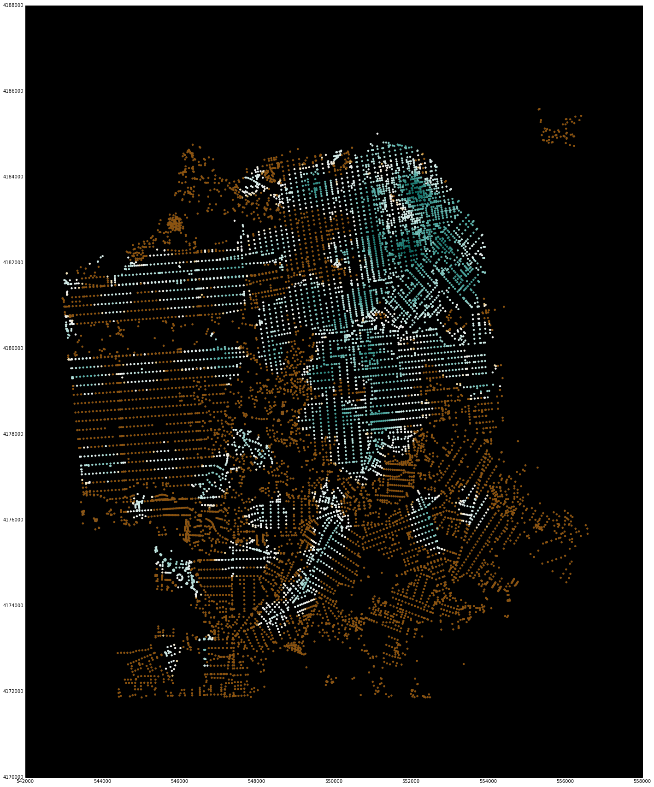
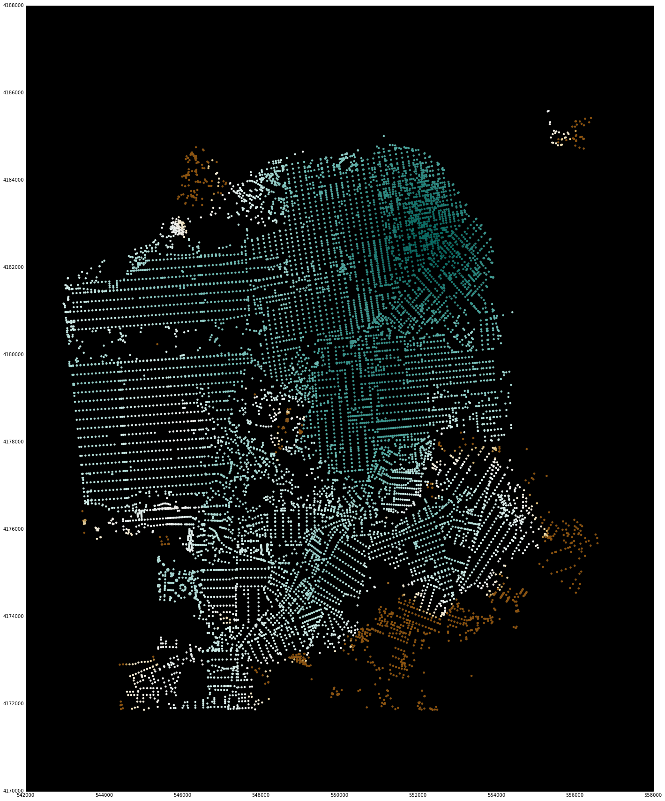

Tutorial
--------

.. note::
    This tutorial was last updated in 2017 and may not be current. The best place
    to start is with the Pandana `demo notebook 
    <https://github.com/UDST/pandana/tree/master/examples/Pandana-demo.ipynb>`_.

At this point it is probably helpful to make concrete the topics discussed in
the introduction by giving code sample.  There is also an IPython Notebook
in the ``Pandana`` repo which gives the entire workflow,
but the discussion here will take things line-by-line with a sufficient
summary of the functionality.

Note that these code samples assume you have imported pandas and pandana as follows::

    import pandas as pd
    import pandana as pdna

Create the network
~~~~~~~~~~~~~~~~~~

First create the network.  Although the API is incredibly simple,
this is likely to be the most difficult part of using Pandana.  In the future
we will leverage the import functionality of tools like ``geopandas`` to
directly access networks via shapefiles,
but for now the initialization :py:meth:`pandana.network.Network.__init__`
takes a small number of Pandas Series objects.

The network is comprised of a set of nodes and edges.
We store our nodes and edges as two Pandas DataFrames in an HDFStore object.
We can access them as follows (the demo data file can be
`downloaded here <https://s3-us-west-1.amazonaws.com/synthpop-data2/pandana/osm_bayarea.h5>`__)::

    store = pd.HDFStore('data/osm_bayarea.h5', "r")
    nodes = store.nodes
    edges = store.edges
    print nodes.head(3)
    print edges.head(3)

The output of the above code shows: ::

                  x           y
    8   629310.1250  4095536.75
    9   629120.9375  4095816.75
    10  628951.5625  4096090.50

    [3 rows x 2 columns]

       from  to      weight
    6     8   9  338.255005
    7     9  10  322.532990
    8    10  11  218.505997

    [3 rows x 3 columns]

The data structure is very simple indeed.  Nodes have an index which is the
id of the node and an x-y position.  Much like ``shapely``, ``Pandana`` is
agnostic to the  coordinate system.  Use your local coordinate system or
longitude then latitude - either one will work.  Edges are then ids (which
aren't used) and
``from`` node ids and ``to`` node_ids which should index directly to the node
DataFrame.  A ``weight`` column (or multiple weight columns) is (are) required
as the impedance for the network.  Here, distance is used from OpenStreetMap
edges.

To create the network given the above DataFrames, simply call: ::

    net=pdna.Network(nodes["x"], nodes["y"], edges["from"], edges["to"],
                     edges[["weight"]])

It's probably a good idea (though not strictly required) to precompute a
given horizon distance so that aggregations don't perform the network queries
unnecessarily.  This is done by calling the following code,
where 3000 meters is used as the horizon distance: ::

    net.precompute(3000)

Note that a large amount of time is spent in the precomputations that take
place for these two lines of code.  On a MacBook, these two lines of code
take 4 seconds and 8.5 seconds respectively.

**This was done on a 4-core cpu, so if your precomputation is much slower,
check the IPython Notebook output (on the console) for a statement that says**
``Generating contraction hierarchies with 4 threads.`` **If your output says
1 instead of 4 you are running single threaded.  If you are running on
a multi-core cpu, there is probably a way to speed up the computation.**

Nearest queries
~~~~~~~~~~~~~~~

Now for the fun part.  Nearest queries are slightly easier, so let's cover that
first.

First initialize the POI (point-of-interest) category: ::

    net.set_pois("restaurants", 2000, 10, x, y)

This code initializes the "restaurants" category with the positions specified
by the x and y columns (which are Pandas Series), at a max distance of 2000 meters
for up to the 10 nearest points-of-interest.  Next perform the query:

Here is a link to the docs: :py:meth:`pandana.network.Network.set_pois` ::

    net.nearest_pois(2000, "restaurants", num_pois=10)

This searches for the 10 nearest restaurants and is exactly the query that is
displayed in the introduction.  This returns a DataFrame with the number of
columns equal to the number of POIs that are requested. For instance,
a describe of the output DataFrame look like this (note that the query
executed in half a second: ::

    CPU times: user 1.37 s, sys: 11 ms, total: 1.38 s
    Wall time: 498 ms
                      1              2              3              4   \
    count  226060.000000  226060.000000  226060.000000  226060.000000
    mean     1542.487481    1676.578324    1746.392002    1794.982571
    std       629.581983     543.853257     485.754919     440.356407
    min         0.000000       0.000000       0.000000       0.000000
    25%      1063.236542    1473.924011    1775.853271    2000.000000
    50%      2000.000000    2000.000000    2000.000000    2000.000000
    75%      2000.000000    2000.000000    2000.000000    2000.000000
    max      2000.000000    2000.000000    2000.000000    2000.000000

                      5              6              7              8   \
    count  226060.000000  226060.000000  226060.000000  226060.000000
    mean     1825.214545    1846.061683    1864.423958    1879.123914
    std       407.388660     380.878320     353.350067     330.835422
    min         0.000000       0.000000       0.000000       0.000000
    25%      2000.000000    2000.000000    2000.000000    2000.000000
    50%      2000.000000    2000.000000    2000.000000    2000.000000
    75%      2000.000000    2000.000000    2000.000000    2000.000000
    max      2000.000000    2000.000000    2000.000000    2000.000000

                      9              10
    count  226060.000000  226060.000000
    mean     1893.909935    1908.403787
    std       306.340819     283.554353
    min         0.000000      56.143002
    25%      2000.000000    2000.000000
    50%      2000.000000    2000.000000
    75%      2000.000000    2000.000000
    max      2000.000000    2000.000000

    [8 rows x 10 columns]

Here is a link to the docs: :py:meth:`pandana.network.Network.nearest_pois`

Aggregation queries
~~~~~~~~~~~~~~~~~~~

Performing a general network aggregation isn't much harder.  In this case,
it is assumed that DataFrames are much larger and that queries have
a lot more variety.

For this reason, the workflow is typically to map the variables x and y to
node_ids (which can then be cached or written to disk at a later date) and
to call ``set`` for each data column, potentially several times.  For instance,
if you have a DataFrame of buildings with x and y coordinates,
you can use ``get_node_ids`` to set node_ids as an attribute on the
buildings table and then ``set`` can be called many times with all the
attributes of the buildings table and their associated column names. ::

    x, y = buildings.x, buildings.y
    buildings["node_ids"] = net.get_node_ids(x, y)
    net.set(node_ids, variable=buildings.square_footage, name="square_footage")
    net.set(node_ids, variable=buildings.residential_units,
            name="residential_units")

Here is a link to the docs: :py:meth:`pandana.network.Network.get_node_ids`
and :py:meth:`pandana.network.Network.set`

Once the variables have been assigned to the network, the user can query the
network repeatedly with different parameters. ::

    s = net.aggregate(500, type="sum", decay="linear", name="square_footage")
    t = net.aggregate(1000, type="sum", decay="linear", name="square_footage")
    u = net.aggregate(2000, type="sum", decay="linear", name="square_footage")
    v = net.aggregate(3000, type="sum", decay="linear", name="square_footage")
    w = net.aggregate(3000, type="ave", decay="flat",
                      name="residential_units")

Here is a link to the docs: :py:meth:`pandana.network.Network.aggregate`

Note that if networks have been indexed and precomputed,
the aggregations should take less than a second up to a distance of roughly
three kilometers for a network with a few hundred thousand nodes.

Display the results
~~~~~~~~~~~~~~~~~~~

An experimental feature for displaying the points of the node_ids and their
associated computed values using matplotlib (so that the entire workflow can
happen in the notebook) is also available.

Note that these have a bounding box for reducing the display window.
Although the underlying library is computing values for all nodes in the
region, it is difficult to visualize this much data using
matplotlib.  For quick interactive checking of results,
the bounding box can be used to reduce the number of points that are shown,
and sample code and images are included below. ::

    sf_bbox = [37.707794, -122.524338, 37.834192, -122.34993]

    net.plot(s, bbox=sf_bbox,
             fig_kwargs={'figsize': [20, 20]},
             bmap_kwargs={'suppress_ticks': False,
                          'resolution': 'h', 'epsg': '26943'},
             plot_kwargs={'cmap': 'BrBG', 's': 8, 'edgecolor': 'none'})

::

    net.plot(u, bbox=sf_bbox,
             fig_kwargs={'figsize': [20, 20]},
             bmap_kwargs={'suppress_ticks': False,
                          'resolution': 'h', 'epsg': '26943'},
             plot_kwargs={'cmap': 'BrBG', 's': 8, 'edgecolor': 'none'}

